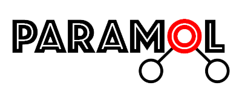

ParaMol
=======

Overview
#########

ParaMol is a Python library that aims to ease the process of force field parametrization of molecules.

Current Version: 1.1.0

About
#######
ParaMol is developed and maintained by João Morado at the University of Southampton.

If you have any question or issue to report please contact j.morado@soton.ac.uk.