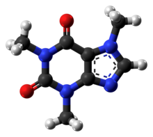

Example 3: Example of adaptive parametrization using caffeine
========================================================================

Adaptive parametrization
##########################

In this example we are going to use ParaMol's adaptive parametrization Task (:obj:`ParaMol.Tasks.adaptive_parametrization.AdaptiveParametrization`) to self-consistently parametrize caffeine. This task performs iterative sampling and parametrization.

.. literalinclude:: ../../../../Examples/Example_3/example_3.py
    :language: python

Quality of the parametrization
###############################

Finally, let us assess the quality of the parametrization by determining the correlation between the :math:`F^{MM}` and :math:`F^{QM}` forces of the original and re-parametrized force field.

For this purpose, we are going to use generate 1000 conformations obtained through molecular dynamics simulation using the re-parametrized force field. The previous example could be modified to perform this task in the following way:

.. literalinclude:: ../../../../Examples/Example_3/example_3_quality.py
    :language: python

