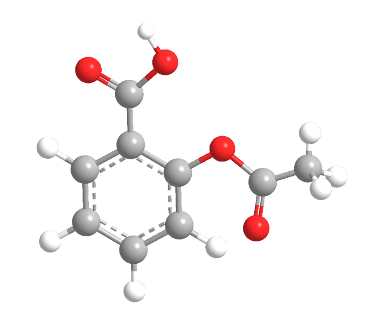

Example 4: Example of atom-type symmetry-constrained parametrization using aspirin
===================================================================================

In this example we will parametrize aspirin while constraining the optimization of the parameters to the atom-type symmetries defined by AMBER. In the parametrization we will use a data set of conformations (and respective eneriges and forces) obtained using a Born-Oppenheimer MD at the DFTB level of theory (including D3 dispersion correction).

Serial Version
###############################

.. literalinclude:: ../../../../Examples/Example_4/example_4_serial.py
    :language: python

Parallel version
###############################
It is also possible to parallelize the calculation of the objective function using, for example, 4 cpus. In order to do this, the following changes have to be made:

.. literalinclude:: ../../../../Examples/Example_4/example_4_parallel.py
    :language: python
