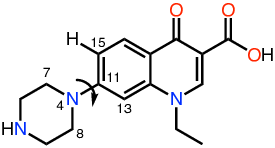

Example 5: Example of torsional scan using a norfloxacin analog
================================================================

Torsional scan recipe
######################

In this example we are going to use ParaMol's torsional scan Task (:obj:`ParaMol.Tasks.torsions_scan.TorsionScan`) to parametrize a torsion of the norfloxacin analog represented above.
First of all, we are going to symmetrize the ParaMol Force Field so that it respects atom-type symmetries and write it to a file in order to choose what torsions we want to parametrize.

.. literalinclude:: ../../../../Examples/Example_5/example_5_write_ff.py
    :language: python

We are interested in parametrizing the torsions around the C11-N4 bond. Hence, the next step is to modify the ParaMol Force Field file in order to set as optimizable all torsions's parameters involved in the rotation of C11 and N4, specifically the phase and barrier heights of these torsions (ParaMol cannot optimize the periodicity). This can be achieved by performing the following modifications on the ParaMol Force Field file:

.. literalinclude:: norfloxacin_symm_original.ff
    :language: text
    :caption: Original ParaMol Force Field file.

.. literalinclude:: norfloxacin_symm_mod.ff
    :language: text
    :caption: Modified ParaMol Force Field file.

Now that we have done the necessary changes in the ParaMol Force Field file, we are ready to perform the torsional scan and subsequent parameters's optimization. Luckily, as all the torsions around the C11-N4 are of the same type and, therefore, they share the same set of parameters, we only need to perform the torsional scan of one of the torsions with symmetry T8. Furthermore, when asking ParaMol to create its Force Field representation, we need to provide the modified ParaMol Force Field file so that ParaMol creates its internal representation of the Force Field from this file. The same procedure can be done to set special constraints or to optimize other parameters.

.. literalinclude:: ../../../../Examples/Example_5/example_5.py
    :language: python

Alternative method (preferred)
###############################
Alternatively, we could have avoided changing manually the Force Field file if we had used the :obj:`ParaMol.Force_field.force_field.ForceField.optimize_torsions_by_symmetry` function. Hence, the whole procedure could be performed using the following code:

.. literalinclude:: ../../../../Examples/Example_5/example_5_alternative.py
    :language: python
