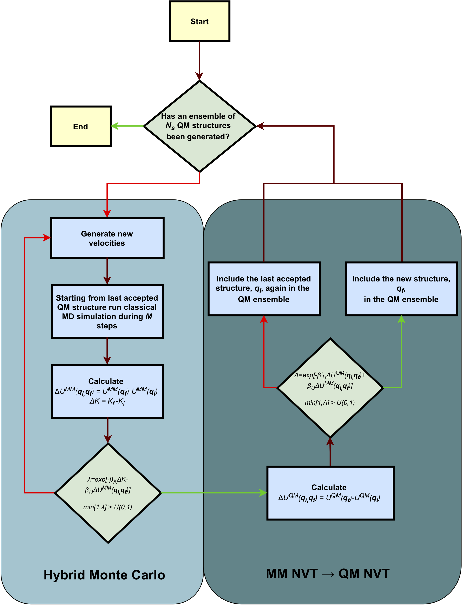

Example 8: Example of sampling using a nested Markov chain Monte Carlo algorithm
=================================================================================

ParaMol has implemented a nested Markov chain Monte Carlo (nMC-MC) algorithm that combines sampling at the MM level
with periodic switching attempts to the QM level. This nMC-MC algorithm works by firstly resorting to the
hybrid Monte Carlo (hMC) scheme to rigorously generate configurations that belong to a target MM ensemble.
These are subsequently used as trial states for a second Markov chain,
wherein they are accepted or rejected according to a correction step based
on the difference between the MM and QM potentials.

    Diagram describing the workflow of nMC-MC algorithm as implemented in ParaMol.

..
    Further information about this method can be found in

Single sampler: Serial Version
###############################

.. literalinclude:: ../../../../Examples/Example_8/example_8_serial.py
    :language: python

Multiple Samplers: Parallel Version
####################################

.. literalinclude:: ../../../../Examples/Example_8/example_8_parallel.py
    :language: python